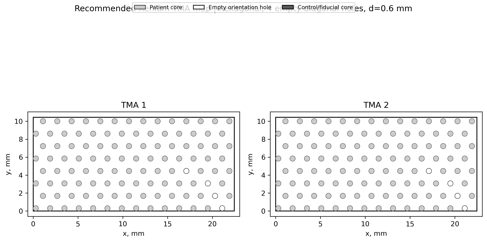
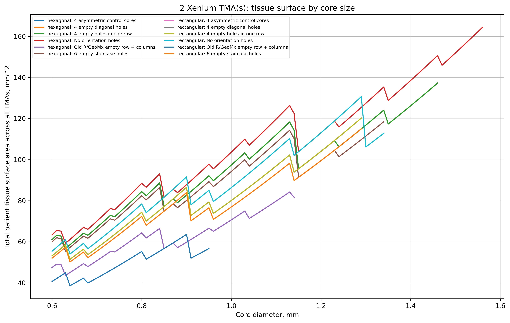
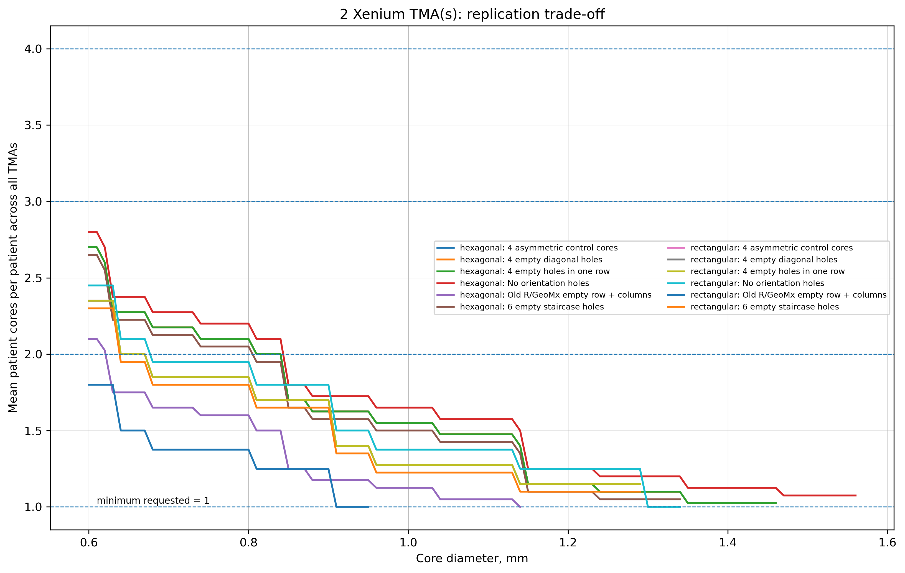
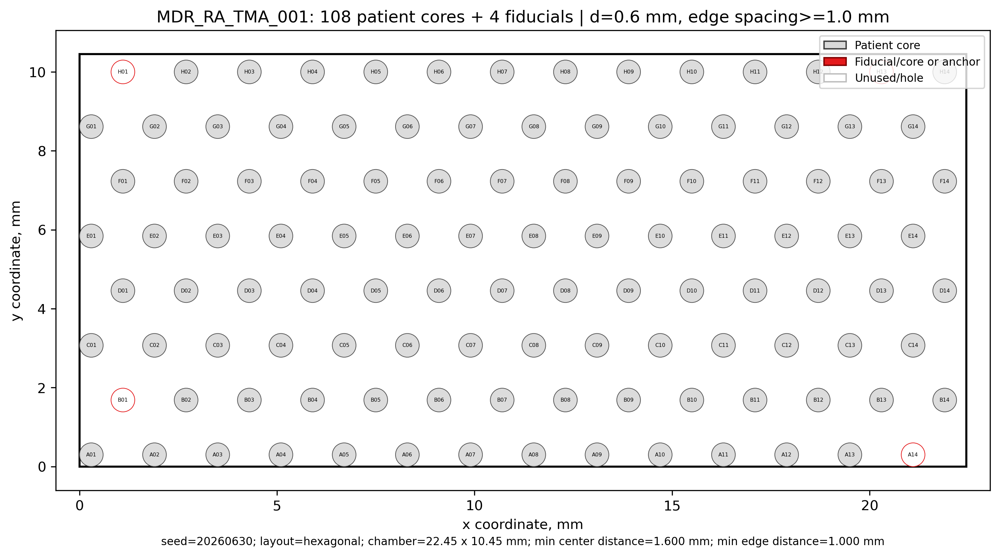

# MDR_RA TMA Compiled Trace

## Purpose

This trace compiles the design assumptions, recommended TMA geometry, output tables, and output figures for the MDR_RA Xenium TMA design.

## Design Snapshot

| Item | Value |
|---|---:|
| Consortium | MDR_RA |
| Patients | 80 |
| TMAs | 2 |
| Patients per TMA | 40 |
| Xenium chamber per TMA | 22.45 x 10.45 mm |
| Chamber area per TMA | 234.60 mm2 |
| Total chamber area | 469.21 mm2 |
| Default core diameter | 0.6 mm |
| Minimum edge-to-edge spacing | 1.0 mm |
| Layout | Hexagonal |
| Orientation markers | 4 compact asymmetric empty holes |

## Recommended Geometry

| Metric | Value |
|---|---:|
| Patient cores per TMA | 108 |
| Patient cores across 2 TMAs | 216 |
| Mean cores per patient | 2.70 |
| Minimum balanced cores per patient | 2 |
| Total core surface / total chamber area | 0.1302 |
| Orientation/control cost | 3.6% |

## Tables

| Table | Role |
|---|---|
| [Area efficiency](../results/tables/mdr_ra_tma_xenium_core_optimization_area_efficiency.csv) | Compares core diameter, layout, empty holes, fiducial/control cores, patient slots, and surface/chamber ratios. |
| [Full comparison](../results/tables/mdr_ra_tma_xenium_core_optimization_comparison.csv) | Full optimizer scenario table. |
| [Best allowed](../results/tables/mdr_ra_tma_xenium_core_optimization_best_allowed.csv) | Best feasible design per allowed core-size/layout/orientation strategy. |
| [Recommended combined map](../results/tables/mdr_ra_tma_xenium_core_optimization_recommended_map.csv) | Recommended two-TMA patient assignment map. |
| [TMA 1 final map](../results/tables/mdr_ra_tma_01_map.csv) | Single-TMA map for P001-P040. |
| [TMA 2 final map](../results/tables/mdr_ra_tma_02_map.csv) | Single-TMA map for P041-P080. |
| [Summary](../results/tables/mdr_ra_tma_xenium_core_optimization_summary.txt) | Human-readable optimizer summary. |

## Figures

## Orientation Rationale

The orientation strategy follows Pilla et al. 2012 (PMCID: PMC3551499): keep a visible, fixed-corner asymmetric marker pattern, avoid full empty rows or columns, and preserve orientation interpretability if a small number of spots are lost.

## Human Review Required

- Confirm final Xenium usable chamber dimensions.
- Confirm TMA Grand Master punch diameters available locally.
- Confirm minimum spacing accepted by the operator for 0.6 mm cores.
- Decide whether empty holes are sufficient or fiducial/control tissue cores are needed.
- Replace synthetic IDs with an approved de-identified patient list before construction.
